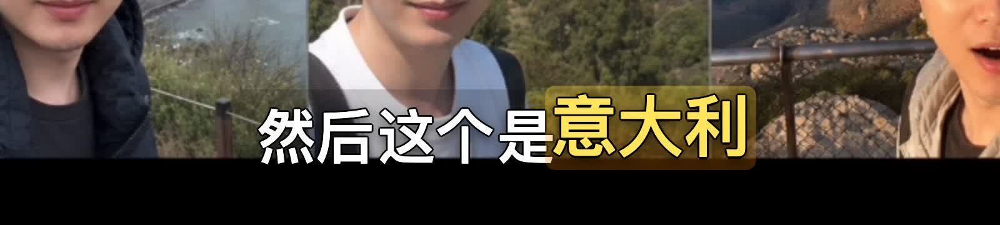

# Remotion Word Highlight Subtitles

Use Whisper word timestamps and Remotion to add short-video subtitles where the word currently being spoken is highlighted.

This Skill is designed for Chinese creator workflows where subtitles need to feel polished, readable, and screenshot-friendly.



## What It Does

- Transcribes a local video with Whisper `word_timestamps`.
- Converts Whisper's word-level JSON into Remotion-friendly `captions.json`.
- Renders subtitles with Remotion instead of burning plain SRT text.
- Highlights the current spoken word in yellow.
- Optionally marks sparse keywords with a secondary accent.
- Keeps subtitles in a lower, screenshot-friendly band by default.
- Writes the rendered video next to the source file.

Default output name:

```text
<source-stem>_remotion逐词高亮字幕.mp4
```

## Installation

Install from ClawHub:

```bash
clawhub install remotion-word-highlight-subtitles
```

Then restart or reload your OpenClaw/Codex environment if your agent does not discover new skills immediately.

## Example Prompts

Use natural prompts like:

```text
给这个视频添加逐词高亮字幕：/absolute/path/to/video.mp4
```

```text
按 Remotion 逐词高亮字幕方案，给这个视频加字幕：/absolute/path/to/video.mp4
```

```text
重新转写 word timestamps，然后给这个视频加当前词高亮字幕：/absolute/path/to/video.mp4
```

The agent should then follow the Skill workflow: inspect the video, transcribe with Whisper, prepare caption JSON, render with Remotion, and verify the output.

## Requirements

The workflow expects these tools to be available locally:

- `python3`
- `ffmpeg`
- `ffprobe`
- `whisper`
- `node`
- `npm`
- Remotion dependencies in the generated or reused Remotion project

The Skill does not upload your video anywhere by itself. It is intended for local video files and local rendering.

## Workflow Summary

1. Read source video metadata with `ffprobe`.
2. Run Whisper with word-level timestamps:

   ```bash
   whisper "/absolute/path/video.mp4" \
     --model turbo \
     --language zh \
     --word_timestamps True \
     --output_format json \
     --output_dir "/absolute/path/output-dir"
   ```

3. Convert Whisper JSON to Remotion caption data:

   ```bash
   python3 scripts/whisper_json_to_captions.py \
     "/absolute/path/transcript.json" \
     "/absolute/path/remotion-project/public/captions.json" \
     --keyword "提示词" \
     --keyword "Codex"
   ```

4. Render the video with a Remotion component that reads `captions.json`.
5. Inspect one or more still frames before the full render when the framing is uncertain.
6. Verify the final video duration and audio with `ffprobe`.

## Caption Style

Baseline style choices:

- Base text is white.
- The current spoken word is yellow.
- Keyword highlights are sparse and secondary.
- Text uses a black shadow/outline, not a heavy stroke.
- The caption position starts around `height * 0.28` bottom padding.
- Avoid large black subtitle boxes unless the footage truly needs extra contrast.

Representative constants:

```tsx
const captionBottom = Math.round(height * 0.28);
const captionFontSize = Math.round(height * 0.032);
const captionMaxWidth = Math.round(width * 0.88);
const activeColor = "#FFE45C";
const keywordColor = "#D6FFF8";
```

## Caption JSON Format

The Remotion project should load `public/captions.json` with this shape:

```json
[
  {
    "text": "然后这个是意大利",
    "startMs": 11860,
    "endMs": 13180,
    "tokens": [
      { "text": "然后", "startMs": 11860, "endMs": 12360, "keyword": false },
      { "text": "这个", "startMs": 12360, "endMs": 12640, "keyword": false },
      { "text": "是", "startMs": 12640, "endMs": 12780, "keyword": false },
      { "text": "意大利", "startMs": 12780, "endMs": 13180, "keyword": true }
    ]
  }
]
```

## Helper Script

The bundled script:

```text
scripts/whisper_json_to_captions.py
```

converts Whisper JSON with `segments[].words[]` into the caption format above.

Useful options:

```bash
--keyword "提示词"
--keyword "Codex"
--merge-term "朋友圈"
--replace "彭丽圈=朋友圈"
```

Use `--replace` for obvious transcription corrections before rendering.

## Notes

This is a Skill for an AI agent, not a standalone one-command video editor. The Skill gives the agent a repeatable workflow and a helper script so it can create the Remotion project, render, and verify the result consistently.

## License

MIT-0. Free to use, modify, and redistribute. No attribution required.
